# Dune: Awakening — Server Manager

> [!CAUTION]
> **This is an experimental assistant dashboard.** I am not associated with Funcom or the Dune: Awakening team and cannot guarantee this will work perfectly for you. Always take backups. This works for me and I thought the community might find it helpful. I ran this myself including the server setup and played on it no problem. I hope you experience the same.

A local web-based UI for managing **Dune: Awakening Self-Hosted Servers**. Replaces the clunky `battlegroup.bat` terminal menu with a clean, modern dashboard that handles everything from first-time setup to daily operations and game configuration.


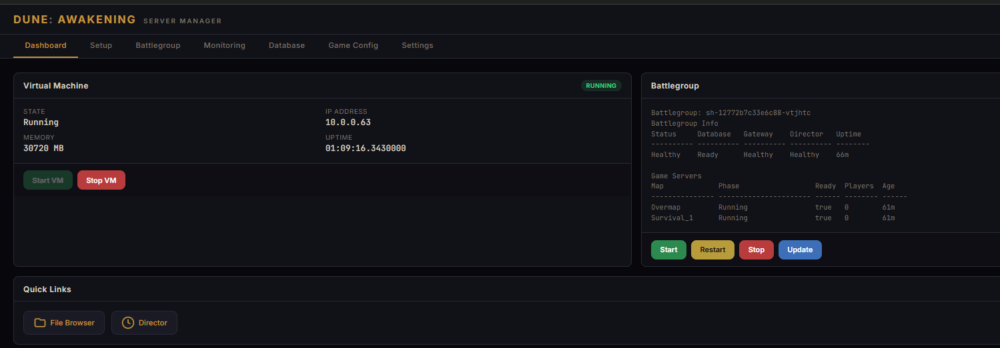

## Features

- **Setup Wizard** — Guided 6-step first-time installation (VM import, network, SSH, bootstrap — no bat file needed)
- **Dashboard** — VM status, memory, uptime, IP, and battlegroup health at a glance
- **Battlegroup Controls** — Start, stop, restart, and update with one click
- **Character Editor** — Edit stats (health, tech points, hydration, spice, Eyes of Ibad) and manage inventory with a searchable 981-item catalog
- **Game Config** — Edit PvP, sandstorms, sandworm behavior, mining rates, decay, building limits, and more through a visual editor
- **Monitoring** — Direct links to the File Browser and Director web interfaces
- **Database** — Take and import backups
- **Log Export** — Download battlegroup and operator logs
- **Settings** — Change VM password, rotate SSH keys, enable swap memory
- **Live Console** — Real-time command output streamed to the browser via WebSocket

## Prerequisites

Before using this tool, you need the following installed and ready:

1. **Windows 10/11 Pro** with hardware virtualization enabled in BIOS
2. **Hyper-V** enabled (Settings → Apps → Optional Features → More Windows Features → Hyper-V)
3. **Dune: Awakening Self-Hosted Server** downloaded via Steam (search "Dune Awakening Self-Hosted Server" in your Steam library under Tools)
4. **Node.js 18+** — [download here](https://nodejs.org) (LTS recommended)
5. **OpenSSH Client** — included with Windows 10/11 by default (verify: run `ssh` in a command prompt)
6. **A server token** from [account.duneawakening.com](https://account.duneawakening.com/)

The app assumes the default Steam install path:

```
C:\Program Files (x86)\Steam\steamapps\common\Dune Awakening Self-Hosted Server\
```

If yours differs, edit `DEFAULT_SERVER_PATH` at the top of `server.js`.

## Quick Start

1. **Clone** this repo anywhere on your server machine:

   ```
   git clone https://github.com/YOUR_USER/dune-server-manager.git
   cd dune-server-manager
   ```

2. **Double-click `start_as_admin.bat`** in Windows Explorer.

   It will:
   - Request **Administrator** privileges (UAC prompt) — required for Hyper-V
   - Install npm dependencies automatically on first run
   - Open `http://localhost:3000` in your default browser

3. If this is a **fresh install**, click the **Setup** tab and follow the wizard. If you've already run the official `battlegroup.bat` initial-setup before, go straight to the **Dashboard**.

> [!IMPORTANT]
> **The app must run as Administrator.** Hyper-V commands require elevated privileges. If you see permission errors, the Node process is not running as admin.
>
> - **Use `start_as_admin.bat`** — it auto-elevates via UAC.
> - Or open an **Administrator Command Prompt / PowerShell**, `cd` into the project folder, and run `npm start`.
> - **Do not run from WSL** — WSL cannot elevate to Windows admin for Hyper-V operations.

## Setup Wizard

The **Setup** tab provides a guided walkthrough that replaces the entire `battlegroup.bat → initial-setup` flow:

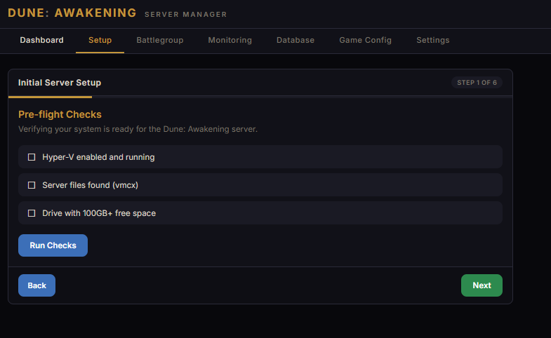

| Step | What happens |
|------|-------------|
| **1. Pre-flight** | Verifies Hyper-V is enabled, server files (`.vmcx`) are present, and a drive has 100GB+ free |
| **2. Configuration** | Enter your server token, choose install drive, VM memory (10–40 GB), network mode, and NIC |
| **3. Installing** | Imports the VM, creates the network switch, resizes the virtual disk, sets memory, and starts the VM — progress streams live |
| **4. Security** | Generates and installs an SSH key, then sets a new password for the `dune` user |
| **5. Networking** | DHCP vs static IP, auto-detects your public IP, lets you pick the player-facing IP |
| **6. Finalize** | Enter your world name and region, upload bootstrap files, run first-time battlegroup setup, optional swap memory |

After setup, flip to the **Dashboard** to start your battlegroup.

## Tabs

### Dashboard

Live overview of your VM and battlegroup with one-click controls.


### Battlegroup

Start, stop, restart, check for updates, and enable swap memory.

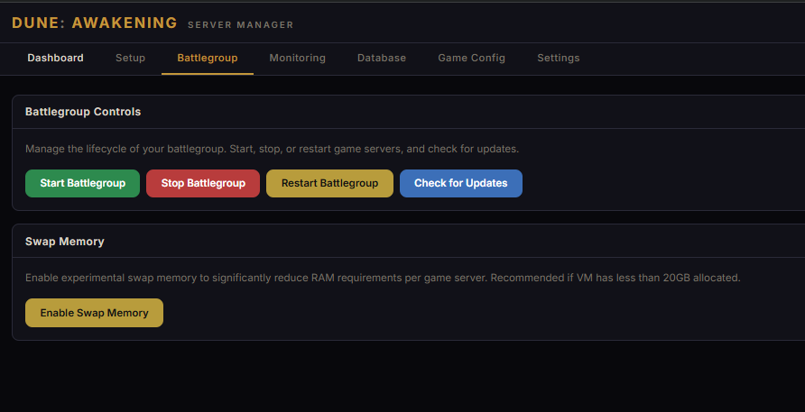

### Monitoring

Quick access to the VM's built-in File Browser and Director interfaces, plus log exports.

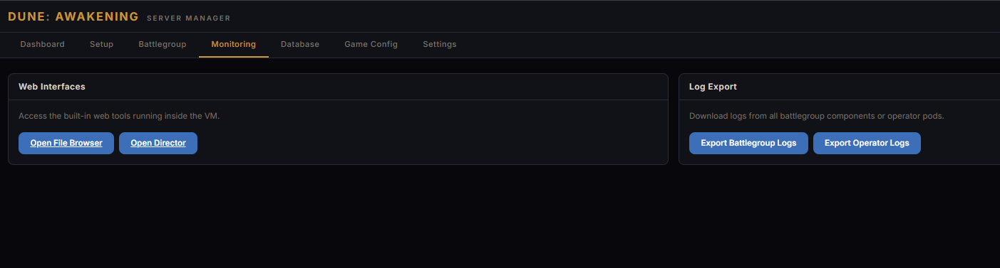

The **File Browser** lets you browse config files, logs, database dumps, and UserSettings directly:

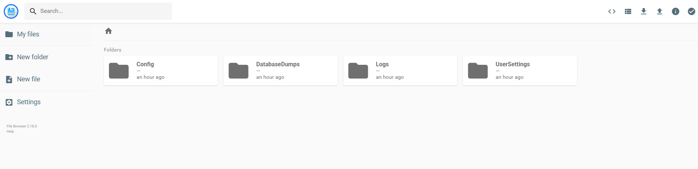

The **Director** shows live battlegroup stats, player counts, character transfer settings, and per-server details:

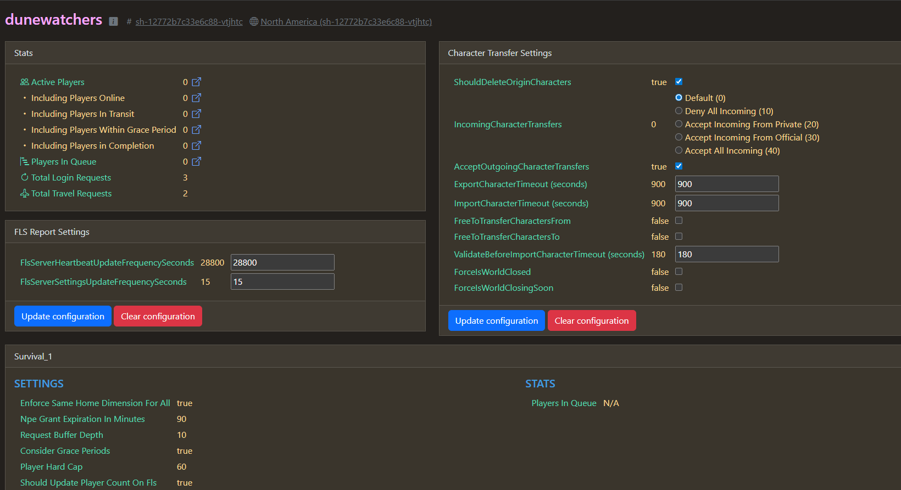

### Database

Back up and restore the battlegroup database. Stop the battlegroup first for best results.

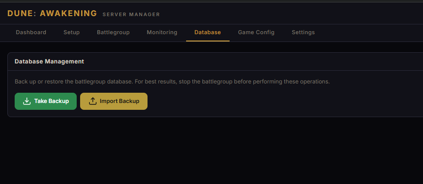

### Characters

Edit player stats and inventory directly in the game database. **Stop the battlegroup and have the player logged out before editing.** Includes a searchable catalog of 981 items scraped from the [community wiki](https://awakening.wiki).

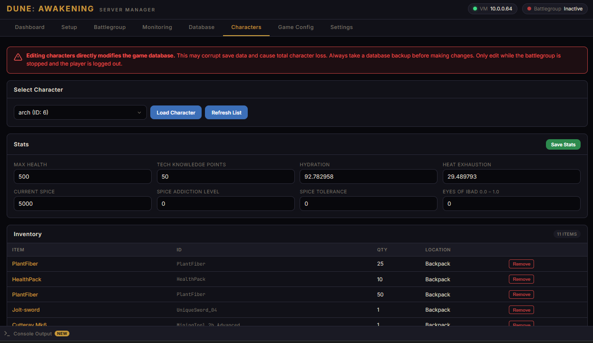

Search for any item by display name, filter by category, and add it to a character's inventory:

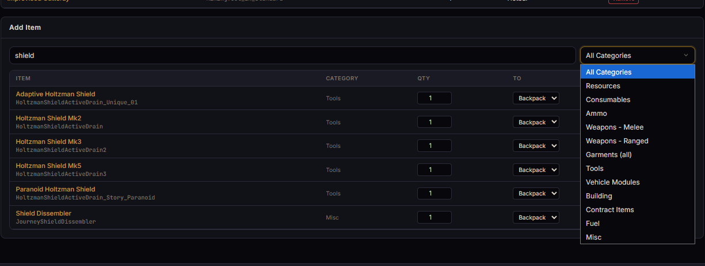

> [!WARNING]
> Editing characters directly modifies the game database. This may corrupt save data and cause total character loss. Always take a database backup first.

| Section | What you can edit |
|---------|------------------|
| **Stats** | Max Health, Tech Knowledge Points, Hydration, Heat Exhaustion, Spice, Addiction Level, Tolerance, Eyes of Ibad |
| **Inventory** | View all items, remove items, add items by name from a 981-item catalog with category filter |
| **Stack limits** | Equipment (weapons/armor/tools) enforced at 1, resources at 100, consumables at 20 — warns before exceeding |
| **Tech Tree** | Unlock or lock all 49 recipes and blueprints with one click |
| **Specializations** | Set level and XP for Combat, Crafting, Exploration, Gathering, Sabotage — unlock all 205 keystones (perks) per tree |
| **Economy** | Set Solari and House Scrip balances |
| **Faction Reputation** | Set reputation with Atreides, Harkonnen, and Smuggler factions |
| **Cosmetics & Skins** | View, add, and remove unlocked weapon skins, armor skins, dye packs, and vehicle cosmetics with human-readable names |

Tech tree, specializations, economy, and faction reputation:

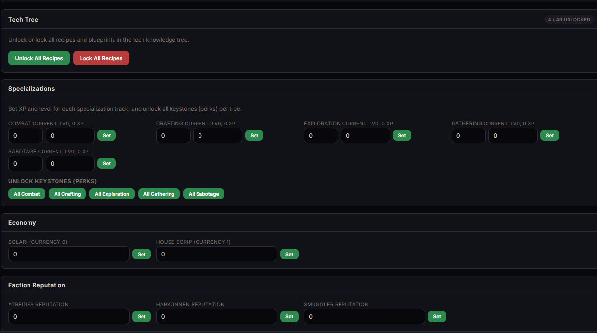

Cosmetics and skins management with plain-language labels:

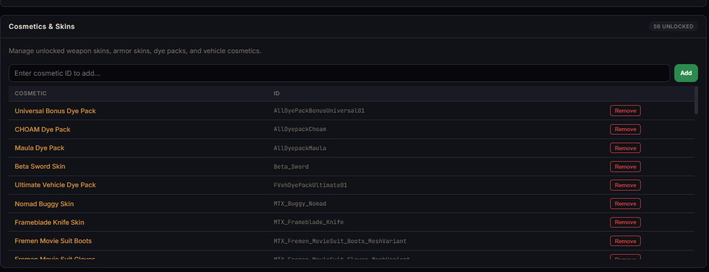

### Game Config

Visual editor for all gameplay settings. **Stop the battlegroup before editing** — changes apply on next start.

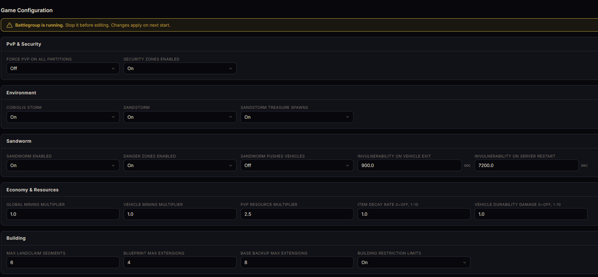

Available settings:

| Category | Settings |
|----------|----------|
| **PvP & Security** | Force PvP on all partitions, security zones |
| **Environment** | Coriolis storms, sandstorms, sandstorm treasure |
| **Sandworm** | Enable/disable, danger zones, vehicle collision, invulnerability timers |
| **Economy & Resources** | Mining multipliers, PvP resource multiplier, item decay rate, vehicle durability |
| **Building** | Max landclaims, blueprint extensions, base backup extensions, restriction limits |
| **Server** | Display name, login password, game port, IGW port |

### Settings

Change the VM password and rotate SSH keys.

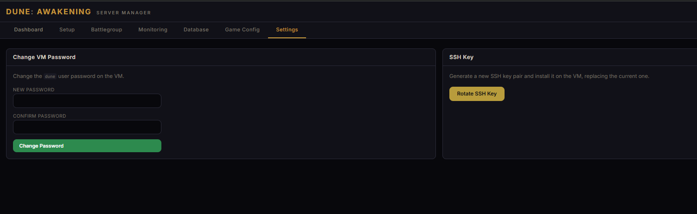

## How It Works

The app is a lightweight Node.js server that:

1. Calls **PowerShell** for Hyper-V operations (start/stop VM, query status, import, configure)
2. Uses **SSH** to communicate with the VM for battlegroup commands (same key and mechanism as the official scripts)
3. Reads and writes **INI config files** on the VM for game settings
4. Queries the **PostgreSQL** database via `kubectl exec` for character editing
5. Serves a static web UI that talks to the REST API and receives real-time output over WebSocket

No data leaves your machine. Everything runs locally on `localhost:3000`.

## Project Structure

```
├── server.js              # Express + WebSocket server, all API routes
├── lib/
│   ├── powershell.js      # PowerShell execution wrapper
│   └── ssh.js             # SSH execution wrapper (with timeout + TTY support)
├── public/
│   ├── index.html         # UI (dashboard, setup wizard, game config, character editor, all tabs)
│   ├── css/style.css      # Dune-themed dark UI
│   ├── js/app.js          # Frontend logic (tabs, wizard, config editor, character editor, API calls)
│   └── data/
│       ├── item-catalog.json   # 981 items with template IDs scraped from awakening.wiki
│       └── stat-reference.json # Character stat keys and inventory type mapping
├── start_as_admin.bat     # One-click Windows launcher (auto-elevates to admin)
├── docs/screenshots/      # README screenshots
└── package.json
```

## Configuration

| Setting | Default | Where to change |
|---------|---------|----------------|
| Server install path | `C:\Program Files (x86)\Steam\steamapps\common\Dune Awakening Self-Hosted Server\` | `DEFAULT_SERVER_PATH` in `server.js` |
| SSH key path | `%LOCALAPPDATA%\DuneAwakeningServer\sshKey` | `getKeyPath()` in `lib/ssh.js` |
| VM name | `dune-awakening` | `VM_NAME` in `server.js` |
| Web UI port | `3000` | `PORT` in `server.js` or `PORT` env variable |

## Troubleshooting

| Problem | Fix |
|---------|-----|
| _"You do not have the required permission"_ | Run the app as **Administrator** (use `start_as_admin.bat` or an admin terminal) |
| _"EADDRINUSE: address already in use :::3000"_ | Another process is on port 3000. Kill it or set a different port: `set PORT=3001 && npm start` |
| _"Node.js is required but not found"_ | Install Node.js 18+ from [nodejs.org](https://nodejs.org) and restart your terminal |
| SSH connection failures | Make sure the VM is running and you've completed initial setup (the SSH key is generated in step 4) |
| _"No .vmcx file found"_ | Verify the Dune Awakening Self-Hosted Server is installed in Steam and the path is correct |
| VM fails to start with memory error | Your system doesn't have enough free RAM. Lower the memory allocation and enable swap memory |
| _"No battlegroup found"_ on start | The initial setup didn't complete. Re-run the setup wizard or use `battlegroup.bat → initial-setup` |

## Ports

If players outside your LAN need to connect, forward these on your router:

| Port | Protocol | Purpose |
|------|----------|---------|
| 7777–7810 | UDP | Game servers |
| 31982 | TCP | RabbitMQ |

The web UI itself (`localhost:3000`) does **not** need to be exposed — it's for local management only.

## License

MIT
